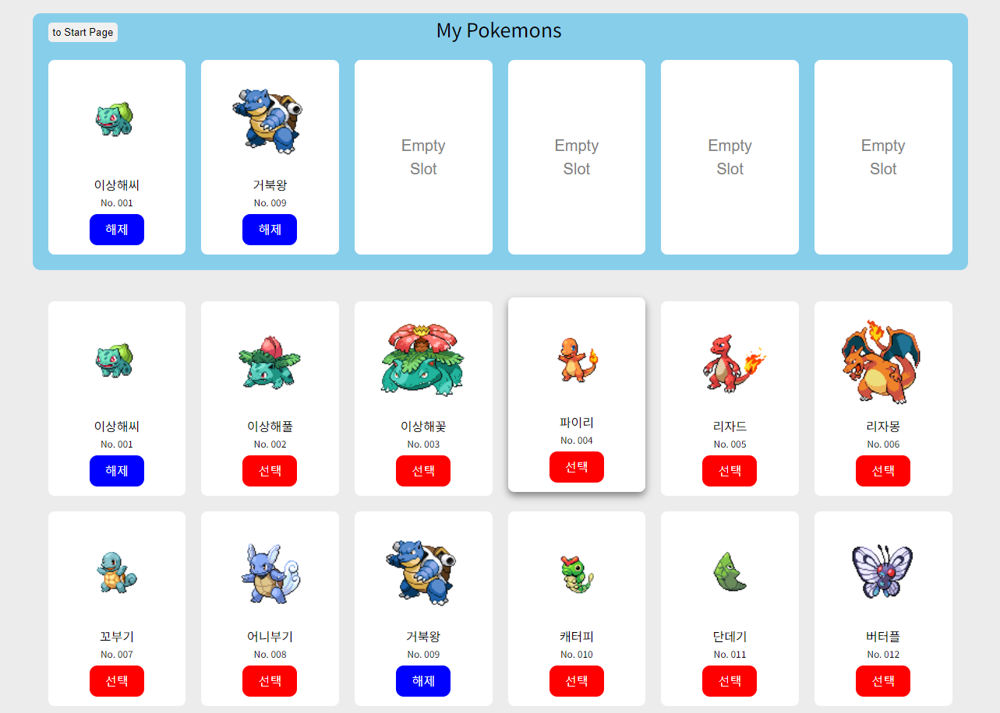
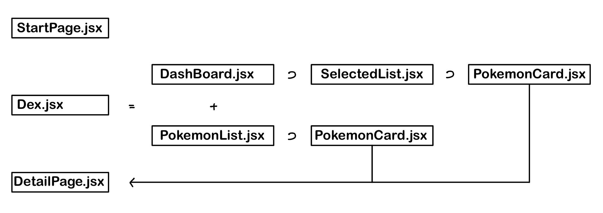

# Pokemon Dex

URL: [https://pokemon-dex-opal.vercel.app/](https://pokemon-dex-qwer.vercel.app/)

151개의 포켓몬 중 최대 6개를 선택할 수 있습니다. 카드를 클릭하면 해당 포켓몬에 대한 세부 정보를 확인할 수 있습니다.

이번 프로젝트는 컴포넌트에 prop을 전달하는 방법에 초점을 맞추어 세 가지 방법을 사용했습니다.

- Prop drilling : 모든 prop을 부모-자식 컴포넌트를 통해 전달합니다.
- Context API : React의 context API를 이용해 state를 관리합니다.
- Redux toolkit : rtk(redux toolkit)을 이용해 state를 관리합니다.

### 컴포넌트 구조 설명

### Branch: prop-drilling

최상위 컴포넌트인 `Dex.jsx`에 `mock`과 `selected`에 대한 state를 저장함. `PokemonCard.jsx`까지 `mock`과 `selected`를 전달해줌. `selected`에 저장될 때 `mock`에서 선택된 카드의 `isSelected`도 변경해주기 위함.

카드가 선택되면 카드 버튼의 색과 글자가 바뀌도록 조건부 스타일링 적용.

### Branch: context

`mock`과 `selected`에 대한 state를 `MockContext.jsx`에 저장해 `Router.jsx`에 적용함. 위에서 처럼 `selected`를 변경할 때 `mock`도 같이 변경해줌.

`useContext` hook을 사용해 `SelectedList.jsx`에서 `selected` state를, `PokemonList.jsx`에서 `mock` state를, `PokemonCard.jsx`에서 `selected` state를 변경할 수 있도록 함.

카드에 hover 효과 추가. Empty slot은 hover 효과가 없도록 조건부 스타일링 적용.

### Branch: redux

`src/redux` 폴더를 추가해 `redux/config/configStore.js`와 `redux/Slices` 폴더에 `mockSlice.js` `selectedSlice.js`를 추가함. `mockSlice.js`에는 `editMock` reducer가 존재하며, `selectedSlice.js`에는 `handleSelected` reducer가 존재함.

`useSelector` hook을 통해 `mock`과 `selected`의 state를 확인할 수 있으며, `useDispatch` hook과 각 slice의 reducer를 통해 action을 전달할 수 있음.

기존에는 `editMock`과 `handleSelected`가 하나의 파일에 작성되어 있었으나 이를 분리함. 이에 따라 카드 버튼 색이 잘 적용이 안 되거나, `selected`의 state가 제대로 변경되지 않는 오류가 발생함. 기존의 카드 내 버튼 이벤트에 `newCard`를 별도로 선언해 각 reducer에 적용하여 오류를 해결함.
